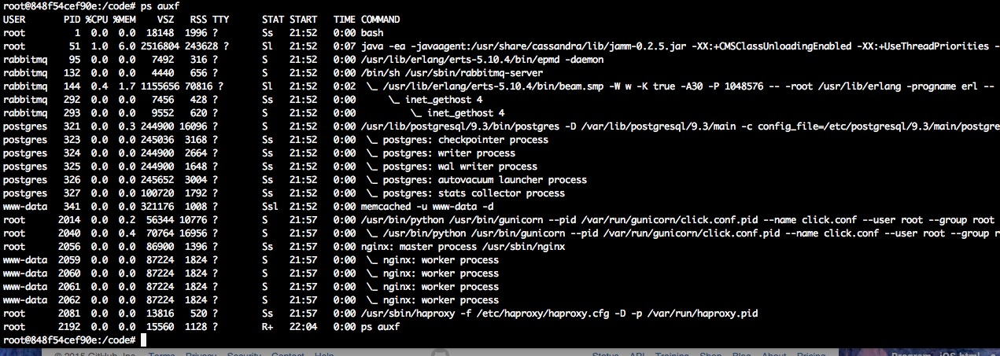

reddit代码部署
===================

:Date: 11/15 2015
:Author: Luozijun

.. contents::

创建Reddit系统镜像
----------------------

创建镜像:

.. code:: bash
	
	cd reddit
	cd system
	./build.sh
	# or
	# docker build -t luozijun/reddit-system .

或者拉取我已经创建好的镜像（推荐）:

.. code:: bash

	# https://hub.docker.com/r/luozijun/reddit-system/
	sudo docker pull luozijun/reddit-system

建议拉取我已经创建好的镜像，因为很多源下载地址在国内下载非常缓慢，甚至无法下载。

部署代码
----------

.. code:: bash
	
	cd reddit
	./build.sh
	# or 
	# docker build -t luozijun/reddit-web .
	# run
	docker run -t -i -expose=2000-10000 luozijun/reddit-web bash

进入Docker 容器后，执行 `/code/install-reddit.sh` 脚本，不出意外，一切应该美好运行 :))

测试
-----------

参考reddit官方维基: https://github.com/reddit/reddit/wiki/reddit-install-script-for-Ubuntu

可能会遇到的一些问题: https://github.com/reddit/reddit/wiki/FAQ
